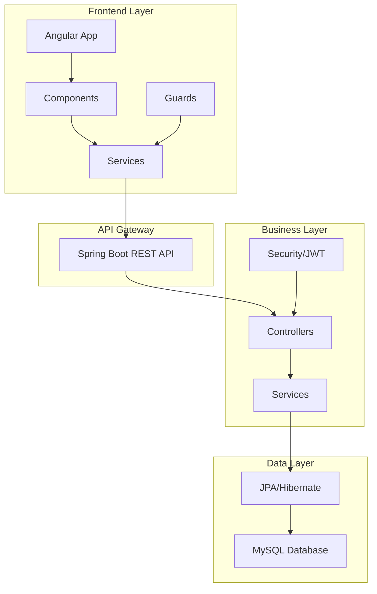
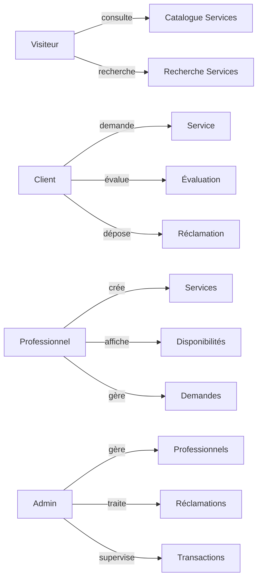

# 🔨 My Bricole - Plateforme de Services de Bricolage


## 📋 Table des Matières

- [À Propos](#-à-propos)
- [Fonctionnalités](#-fonctionnalités)
- [Technologies Utilisées](#-technologies-utilisées)
- [Architecture](#-architecture)
- [Installation](#-installation)
- [Utilisation](#-utilisation)
- [Schémas UML](#-schémas-uml)
- [API Documentation](#-api-documentation)
- [Équipe](#-équipe)
- [Licence](#-licence)

## 🎯 À Propos

**My Bricole** est une application web moderne qui connecte les clients avec des professionnels du bricolage. La plateforme permet aux utilisateurs de demander des services, aux professionnels de proposer leurs compétences, et aux administrateurs de superviser l'ensemble des activités.

### 🎯 Objectifs
- Faciliter la mise en relation entre clients et professionnels
- Créer un environnement sécurisé pour les transactions de services
- Offrir une interface intuitive et moderne
- Assurer une gestion efficace des demandes et propositions

## ✨ Fonctionnalités

### 👥 Pour les Utilisateurs

#### 🔍 **Visiteurs**
-  Consultation du catalogue de services
-  Recherche de services spécifiques
-  Accès aux détails des services

#### 👤 **Clients**
-  Authentification sécurisée
-  Demande de services
-  Évaluation des services
-  Dépôt de réclamations

#### 🔧 **Professionnels**
-  Gestion des services
-  Création de services
-  Affichage des disponibilités
-  Traitement des demandes

#### 👨‍💼 **Administrateurs**
-  Supervision globale
-  Gestion des professionnels
-  Traitement des réclamations
-  Supervision des transactions

## 🛠 Technologies Utilisées

### Backend


### Frontend


### DevOps & Outils


## 🏗 Architecture

### Architecture Système


### Architecture en Couches
```
┌─────────────────────────────────┐
│       Presentation Layer        │
│         (Angular)               │
├─────────────────────────────────┤
│       Business Layer            │
│      (Spring Boot)              │
├─────────────────────────────────┤
│       Data Access Layer         │
│    (JPA/Hibernate)              │
├─────────────────────────────────┤
│       Database Layer            │
│        (MySQL)                  │
└─────────────────────────────────┘
```

## 🚀 Installation

### Prérequis
-  Java 11 ou supérieur
-  Node.js 16 ou supérieur
-  MySQL 8.0 ou supérieur
-  Docker (optionnel)

### Installation Locale

1. **Cloner le repository**
   ```bash
   git clone https://github.com/votre-username/my-bricole.git
   cd my-bricole
   ```

2. **Configuration Base de Données**
   ```sql
   CREATE DATABASE my_bricole_db;
   CREATE USER 'my_bricole_user'@'localhost' IDENTIFIED BY 'password';
   GRANT ALL PRIVILEGES ON my_bricole_db.* TO 'my_bricole_user'@'localhost';
   ```

3. **Backend Setup**
   ```bash
   cd backend
   # Configurer application.properties
   mvn clean install
   mvn spring-boot:run
   ```

4. **Frontend Setup**
   ```bash
   cd frontend
   npm install
   ng serve
   ```

### Installation avec Docker

```bash
# Construire et lancer tous les services
docker-compose up -d

# L'application sera accessible sur :
# Frontend: http://localhost:4200
# Backend API: http://localhost:8080
# Base de données: localhost:3306
```

## 📚 Utilisation

### Interface Utilisateur

#### 🏠 **Page d'Accueil**
- Présentation des services disponibles
- Accès rapide à l'inscription/connexion
- Navigation intuitive

#### 🔐 **Authentification**
```typescript
// Exemple de connexion
const loginData = {
  email: "user@example.com",
  password: "securePassword123"
};

authService.login(loginData).subscribe(
  response => {
    // Redirection vers dashboard
  }
);
```

#### 📋 **Gestion des Projets**
- Création de nouveaux projets
- Upload d'images
- Suivi des demandes

## 📊 Schémas UML

### Diagramme de Cas d'Utilisation


### Diagramme de Classes Simplifié
```mermaid
classDiagram
    class Utilisateur {
        +Long id
        +String nom
        +String email
        +String motDePasse
        +Role role
        +authentifier()
    }
    
    class Client {
        +String adresse
        +List~Demande~ demandes
        +List~Proposition~ propositions
    }
    
    class Professionnel {
        +List~Service~ services
        +List~Review~ reviews
        +List~Proposition~ propositions
    }
    
    class Administrateur {
        +List~Client~ clients
        +List~Professionnel~ professionnels
        +List~Demande~ demandes
    }
    
    class Demande {
        +String titre
        +String description
        +BigDecimal prix
        +List~Proposition~ propositions
    }
    
    class Service {
        +String nom
        +String description
        +BigDecimal prix
    }
    
    class Review {
        +int note
        +String commentaire
    }
    
    Utilisateur <|-- Client
    Utilisateur <|-- Professionnel
    Utilisateur <|-- Administrateur
    
    Client ||--o{ Demande
    Professionnel ||--o{ Service
    Service ||--o{ Review
    Demande ||--o{ Proposition
```

## 🔌 API Documentation

### Endpoints Principaux

#### Authentication
```http
POST /api/auth/login
Content-Type: application/json

{
  "email": "user@example.com",
  "password": "password123"
}
```

#### Services
```http
GET /api/services
Authorization: Bearer <token>

POST /api/services
Authorization: Bearer <token>
Content-Type: application/json

{
  "nom": "Plomberie",
  "description": "Réparation de fuites",
  "prix": 50.00
}
```

#### Projets
```http
GET /api/projects
Authorization: Bearer <token>

POST /api/projects
Authorization: Bearer <token>
Content-Type: multipart/form-data

title: "Rénovation Cuisine"
description: "Renovation complète"
image: [file]
```

### Codes de Statut
-  Succès
-  Ressource créée
-  Requête invalide
-  Non authentifié
-  Accès interdit
-  Ressource non trouvée
-  Erreur serveur

## 🔒 Sécurité

### Mesures de Sécurité Implémentées

- **Authentification JWT** : Tokens sécurisés pour l'authentification
- **Chiffrement BCrypt** : Mots de passe hashés avec BCrypt
- **Gestion des Rôles** : Système de permissions (ADMIN, USER)
- **Guards Angular** : Protection des routes sensibles
- **Validation des Données** : Validation côté client et serveur
- **CORS Configuration** : Configuration sécurisée des origines

### Configuration de Sécurité
```java
@Configuration
@EnableWebSecurity
public class SecurityConfig {
    
    @Bean
    public PasswordEncoder passwordEncoder() {
        return new BCryptPasswordEncoder();
    }
    
    @Bean
    public JwtAuthenticationEntryPoint jwtAuthenticationEntryPoint() {
        return new JwtAuthenticationEntryPoint();
    }
}
```


### Encadrement
**Monsieur Slimane Bah** - Encadrant Académique

---

## 📈 Métriques du Projet


## 🚀 Roadmap & Évolutions Futures

### Version 2.0 - À venir
- [ ] Intelligence Artificielle pour l'analyse des projets
- [ ] Chat en temps réel entre clients et professionnels
- [ ] Application mobile complémentaire (React Native)
- [ ] Système de géolocalisation avancé
- [ ] Intégration de moyens de paiement en ligne
- [ ] Notifications push en temps réel
- [ ] Système de recommandations personnalisées

### Améliorations Techniques
- [ ] Migration vers microservices
- [ ] Intégration CI/CD avec GitHub Actions
- [ ] Tests automatisés (Jest, Cypress)
- [ ] Monitoring avec Prometheus & Grafana
- [ ] Cache Redis pour les performances
- [ ] API Rate Limiting

## 🐛 Signaler des Bugs

Si vous trouvez un bug, veuillez créer une issue en utilisant le template suivant :

```markdown
**Description du Bug**
Description claire et concise du problème.

**Reproduction**
Étapes pour reproduire le comportement :
1. Aller à '...'
2. Cliquer sur '....'
3. Faire défiler vers '....'
4. Voir l'erreur

**Comportement Attendu**
Description claire de ce qui devrait se passer.

**Screenshots**
Si applicable, ajouter des screenshots.

**Environnement:**
 - OS: [e.g. Windows, macOS, Linux]
 - Navigateur [e.g. chrome, safari]
 - Version [e.g. 22]
```

## 🤝 Contribution

Les contributions sont les bienvenues ! Veuillez lire notre [CONTRIBUTING.md](CONTRIBUTING.md) pour plus de détails sur notre code de conduite et le processus de soumission des pull requests.

### Processus de Contribution
1. Fork le projet
2. Créer une branche feature (`git checkout -b feature/AmazingFeature`)
3. Commit vos changements (`git commit -m 'Add some AmazingFeature'`)
4. Push vers la branche (`git push origin feature/AmazingFeature`)
5. Ouvrir une Pull Request


<div align="center">
  <p><strong>Made with ❤️ by the My Bricole Team</strong></p>
  <p>
    <a href="#top">⬆️ Retour au top</a>
  </p>
</div>

---

**Année Universitaire 2024/2025**  
**Filière : Génie Informatique et Digitalisation**
